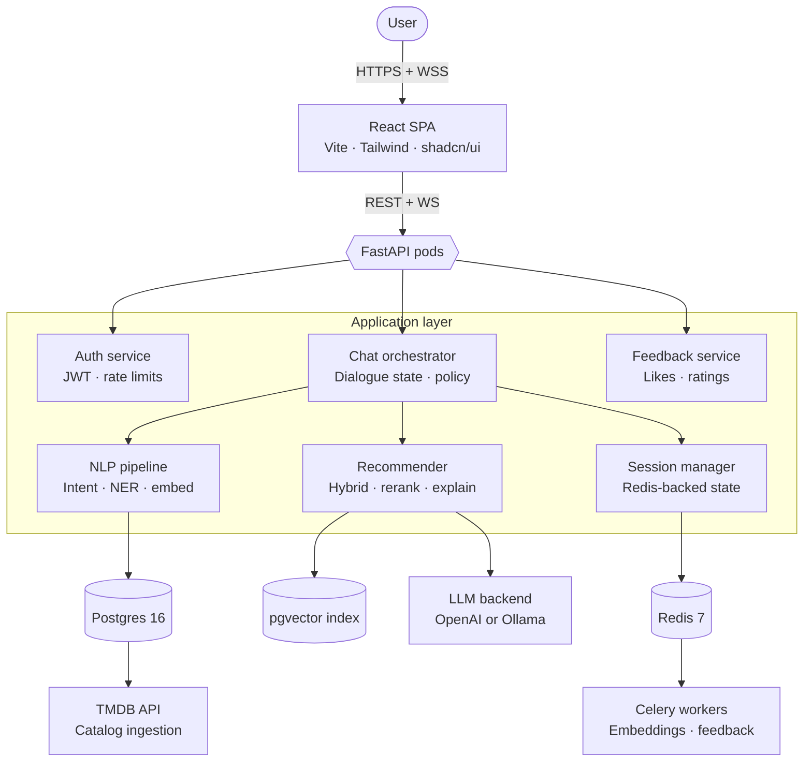
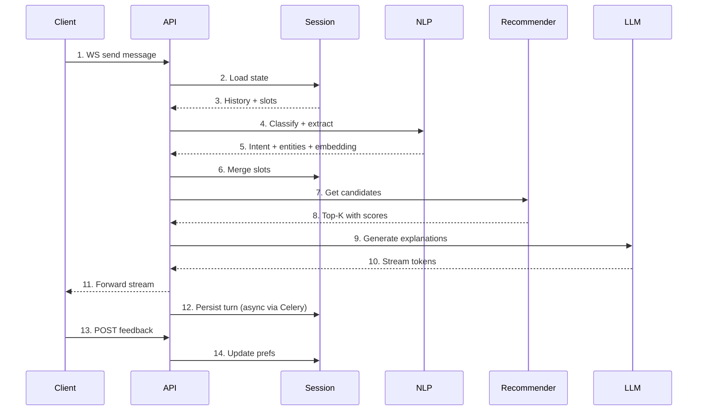

# CineBot — architecture

## High-level

## Chat turn — sequence

## Notes

- NLP runs in-process (no network hop between API and NLP pipeline).
- Step 9 is wrapped in tenacity retry + circuit breaker; provider toggle via `LLM_PROVIDER` env.
- Step 12 is non-blocking — the response to the user does not wait on persistence.
- Embedding generation during ingestion is batched through a Celery worker, not the hot path.
